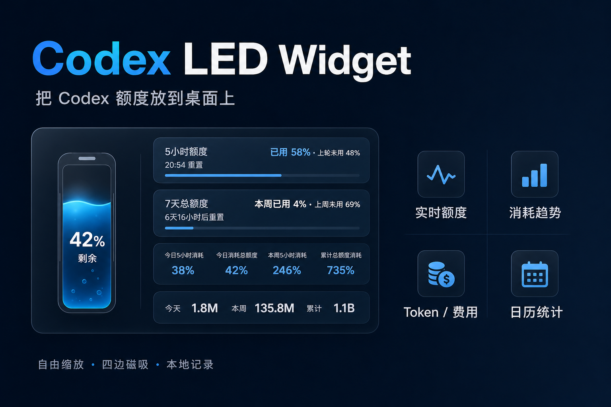

# Codex 额度桌面助手

<p align="center">
  
</p>

<p align="center">
  一个可自由缩放、可高度定制的 Windows Codex 额度悬浮窗。
</p>

<p align="center">
  <a href="#下载与使用">下载与使用</a> ·
  <a href="USER_GUIDE.zh-CN.md">使用说明书</a> ·
  <a href="#主要功能">主要功能</a> ·
  <a href="#隐私说明">隐私说明</a> ·
  <a href="#english">English</a>
</p>

## 主要功能

- 按 Codex 服务端返回的真实窗口时长识别 5 小时与 7 天额度；Pro 账号只有 7 天窗口时只显示 7 天卡，不再误标为 5 小时额度。
- 支持在设置页切换 Codex、Spark 等服务端返回的额度来源，每个来源的窗口和历史记录彼此独立。
- 圆球、电池两种能量仪表；电池支持横向和竖向。
- 窗口、卡片、左右区域和仪表都可自由缩放；电池、圆球和卡片支持四边与四角拖动，并自动记住位置、尺寸与显示选项。
- 可选贴边磁吸：支持屏幕上下左右四边，鼠标移开后立即开始收起、移回唤醒；左右吸附时仪表可自动换到靠屏幕内侧，也可手动固定在左侧或右侧。两种方向会镜像保持相同分栏比例；横向电池磁吸时自动化为只显示剩余额度的精简横条。
- 剩余额度从 50% 开始平滑变色，35% 和 10% 为黄色、红色关键节点；可关闭变色，也可在“统一按 5 小时额度”与“各模块按自身额度”间切换。
- 丝滑液面、随机气泡、粒子与高光动画，速度会随额度变化。
- 5 小时与 7 天消耗图可分别开启，并显示理论匀速与实际消耗。
- 独立额度统计页：今天、本周、累计额度，按模型拆分的 Token，以及美元/人民币 API 等值估算。
- API 价格不写死：按实际出现的模型读取 OpenAI 官方模型页，并缓存输入、缓存输入、缓存写入与输出价格；无法定价的内部模型会明确标记。
- 统计页内有独立的“模型与价格设置”：可重新扫描 Codex 模型、刷新官方价格、手动覆盖单个模型的四项单价并恢复官方自动更新；未来 Codex 出现新模型时会自动进入列表，代码层也保留可注册的价格来源接口。
- GPT/GitHub 风格的格子消耗日历：单月模式使用放大的 7 列日期格；多月模式是一条可左右拖动、跨年份首尾连续并按需延伸的每日格子时间线，选中月份默认居中高亮、相邻月份自动降低亮度；年视图可在“12个月大格”和“全年每日小格”间切换；悬停可查看当前消耗，单位支持总额度%、Token、美元、人民币。
- 消耗图在关闭期间仍持续记录，重新开启或重启应用不会清空同一额度周期的历史。
- 统计页秒开最近一次完整结果；应用在后台每 60 秒统一刷新，避免打开页面时重复扫描。
- 右键菜单改为扁平快捷菜单，常用的显示/隐藏、刷新、置顶、统计和设置都可直接点击，不再通过会闪烁或错位的多层原生子菜单操作。
- 独立设置窗口集中管理额度来源、仪表、卡片、图表、统计和成本显示；修改即时保存，5 小时/7 天高级选项按需展开，重复打开只复用同一个设置窗口。
- 设置页的“悬浮窗卡片”提供独立总开关：关闭时只隐藏已勾选卡片，不改变各卡片的勾选组合；重新开启时只恢复原来勾选的卡片。无卡片时圆球、横向电池和竖向电池会随窗口空间自适应到合理尺寸。
- 启动后会检查 GitHub 最新正式发行版；发现更高版本时弹窗提醒，同一个新版本只提醒一次。
- 首次运行会自动恢复可能缩到屏幕边缘外的旧磁吸布局，并通过 Codex 官方登录页完成账户初始化；布局修复只执行一次，不会清空历史、统计或外观设置。
- 启动时先把上次额度标为缓存，再完成官方会话握手、账户刷新和实时额度同步；登录或网络异常时可在初始化窗口重试。

## 来源与鸣谢

本项目基于 [xicunwus2025-sys/codex-led-widget](https://github.com/xicunwus2025-sys/codex-led-widget) 继续开发。感谢原作者提供最初的 Windows Codex 额度悬浮窗构想与实现基础；当前版本在此基础上对界面、缩放布局、仪表动画、消耗图、磁吸、历史统计、Token/费用和日历等功能进行了大量扩展。

原项目 README 声明使用 MIT License，当前版本继续采用 MIT License，并保留原项目与当前修改者的署名。完整说明请查看 [NOTICE](NOTICE.md) 和 [LICENSE](LICENSE)。本项目是社区工具，与 OpenAI 没有官方隶属或背书关系。

## 下载与使用

1. 打开仓库的 [Releases](https://github.com/q1433031046-ship-it/codex-led-widget/releases) 页面。
2. 下载 `Codex-Quota-Desktop-Assistant-1.2.0-Windows-x64-Setup.exe`。
3. 确认 Windows 版 Codex 已安装，然后双击安装；如本机登录状态不可用，首次启动会自动打开官方登录页。
4. 右键悬浮窗或系统托盘图标打开快捷菜单，再选择“设置”进入完整设置窗口。

第一次使用或想了解全部功能，请查看 [《Codex 额度桌面助手使用说明书》](USER_GUIDE.zh-CN.md)。

运行要求：Windows 10/11 x64、已安装并登录 Codex。

> 当前发布文件未进行商业代码签名。Windows 首次运行时可能显示“未知发布者”，确认文件来自本仓库后可选择“更多信息 → 仍要运行”。

## 额度与统计说明

- “今日”按本地时间每天 00:00 重新开始。
- “本周”按本地时间每周一 00:00 重新开始。
- 5 小时与 7 天并非按数组顺序猜测，而是按 Codex 返回的 `windowDurationMins` 识别；当前来源没有某个窗口时，对应卡片和控制项会隐藏或说明不可用。
- 切换额度来源不会混用消耗曲线；每个来源、每个窗口分别保存历史。
- 账号名称用于建立本机账号档案；更换登录账号后会自动切换到对应档案，首次迁移会保留旧版根目录文件作为回滚副本。模型会话日志来自本机 Codex 全局目录，无法可靠归属到单一账号，因此不会伪装成账号级数据。
- 日历默认显示当前月份，可直接选择其他月份；年视图提供 12 个月汇总与全年每日明细两种样式。只有本工具开始记录后的额度百分比数据可用于历史格子。
- Token 总数来自账户/本机可读取的使用记录；模型明细来自本机 Codex 会话日志，因此会显示单独的统计起始时间。
- 金额按各模型当前官方输入、缓存输入、缓存写入和输出价格做 API 等值估算，不代表订阅账单或实际扣费；无法取得价格的模型不会混入金额。
- 美元兑人民币汇率由公开汇率接口提供；接口不可用时保留美元金额并显示人民币汇率待更新，不使用写死的备用汇率。

## 隐私说明

- 使用 Codex 官方账户接口和官方浏览器登录页，不在本工具中输入或保存密码、认证 Token、登录地址或设备代码；经用户同意，会在本机账号档案中保存可见的账号名称和套餐类型，用于区分不同账号的记录。
- 额度、Token 历史、窗口设置与统计快照保存在当前电脑。
- 不上传额度或 Token 使用数据。
- “复制诊断信息”只包含版本、额度来源、窗口时长、百分比、刷新状态等白名单字段，不包含认证信息、账号名称、账号标识或本机路径。
- 应用只会向 OpenAI 官方模型文档读取公开价格、向公开汇率接口读取 USD/CNY，并向 GitHub Releases 检查最新正式版本；这些请求不会携带你的用量数据。

## 本地开发

```powershell
corepack enable
pnpm install --frozen-lockfile
pnpm run dev
```

生成唯一的 Windows 安装程序：

```powershell
pnpm run release
```

输出位于 `dist/Codex-Quota-Desktop-Assistant-1.2.0-Windows-x64-Setup.exe`。安装后的程序直接从安装目录运行，不会在每次启动时向临时目录解压完整副本。

## GitHub 发布

正式版本由维护者在本地完成检查和构建，再将唯一的 Windows `.exe` 上传到 GitHub Releases。

```powershell
git tag v1.2.0
git push origin v1.2.0
```

## 项目结构

```text
assets/                  screenshots
src/main/                Electron main process and local quota service
src/renderer/            widget and statistics UI
scripts/                 visual and behavior checks
```

## 开源协议

[MIT](LICENSE)

---

## English

Codex Quota Desktop Assistant is a customizable Windows desktop assistant for Codex quota monitoring. It classifies quota windows by the server-provided duration, supports selectable quota sources, and includes resizable orb and battery meters, local quota history, token and estimated API cost statistics, and a GitHub-style contribution calendar.

The statistics page opens from the last complete local snapshot and shares one fixed 60-second background refresh with the widget. Optional four-edge magnetic docking starts retracting immediately after pointer leave and restores the widget on hover. Window size, position, layout, and display preferences are remembered locally.

### Attribution

This project is a derivative of [xicunwus2025-sys/codex-led-widget](https://github.com/xicunwus2025-sys/codex-led-widget), whose README declared the MIT License. The current version substantially extends the original project and retains attribution for both the upstream work and subsequent modifications. See [NOTICE](NOTICE.md) and [LICENSE](LICENSE). This is a community project and is not officially affiliated with or endorsed by OpenAI.

### Download

Download `Codex-Quota-Desktop-Assistant-1.2.0-Windows-x64-Setup.exe` from [GitHub Releases](https://github.com/q1433031046-ship-it/codex-led-widget/releases). Windows 10/11 x64 and an installed Codex app are required. First run safely recovers broken legacy docking coordinates and opens the official browser login when needed. The installed app runs directly from its installation directory instead of unpacking a portable copy on every launch. A newer official release triggers one notification per version.

### Privacy

The app uses the official Codex account flow and never asks for or stores your password, authentication token, login URL, or device code. With your approval, it stores the visible account name and plan type locally so quota history and preferences remain separated when you change accounts. External requests retrieve public model prices, the USD/CNY exchange rate, and the latest GitHub release metadata; no usage data is included.

### Build

```powershell
corepack enable
pnpm install --frozen-lockfile
pnpm run release
```

Licensed under the [MIT License](LICENSE).
